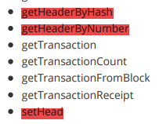
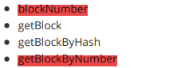
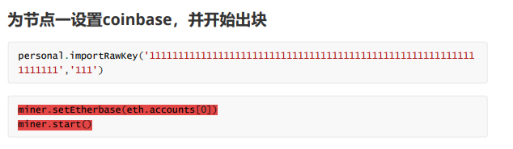
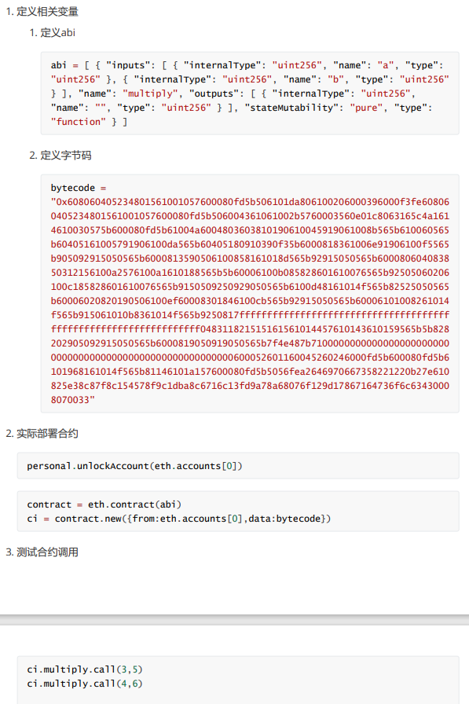
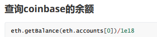

## 区块链仿真平台
---
### 命令行使用说明

#### 1. 已实现命令(请注意有些有括号，有些没有括号)
* clear:清屏指令
* eth.blockNumer:返回最新块的编号
* eth.getBlock(hashOrNum):返回指定块，参数:块的哈希值或块的编号
* eth.getBlockByHash(hash):返回指定哈希值的块，参数：块的哈希值或块的编号(由于和getBlock是同一种实现函数，所以哈希值或块的编号都行)
* eth.getBlockByNumber(num):返回指定编号的块，参数：块的哈希值或块的编号(由于和getBlock是同一种实现函数，所以哈希值或块的编号都行)
* eth.getBlockTransactionCount(hashOrNum):返回指定块中的交易数量，参数：块的哈希值或块的编号
* eth.getBlockUncleCount(hashOrNum):返回指定块的叔伯数量，参数：块的哈希值或块的编号
* eth.getCode(codeAddr):返回指定以太坊地址处的代码，参数：代码地址。**未验证该指令功能可行性**
* eth.getGasPrice:获取当前gas价格，该价格由最近的若干块的gas价格中值决定
* eth.getHashrate:读取当前挖矿节点的每秒钟哈希值算出数量
* eth.getTransaction(transactionHash):返回具有指定哈希值的交易对象，参数：交易的哈希值。**未验证该指令功能可行性**
* eth.getTransactionCount(accountAddr):返回指定地址发出的交易数量，参数：交易的地址。**未验证该指令功能可行性**
* eth.getTransactionFromBlock(hashStringOrNumber, indexNumber):返回指定块中特定索引号的交易对象，参数1：块编号或块的哈希值；参数2：交易索引位置。**未验证该指令功能可行性**
* eth.getTransactionReceipt(transactionHash):返回指定交易的收据对象，参数：交易的哈希值。**未验证该指令功能可行性**
* eth.accounts:返回当前节点控制的账户列表
* eth.getBalance(accountAddr):获取指定块中特定账户地址的余额，参数：账户地址
* miner.setEtherbase(coinbase):为节点设置coinbase，参数：账户地址。**由于接口将该指令和miner.start指令合在了一起，所以该指令并不具有对应的功能，只用于改变出块接口参数**
* miner.start():开始出块，有括号，无参数
* personal.sendTransaction(transactionObject, password):向以太坊网络提交一个交易，参数1：一个交易对象；参数2：发起交易方的账户密码
* personal.importRawKey(privateKey, password):将给定的私钥导入密钥存储区，并使用密码对其进行加密，参数1：账户私钥；参数2：账户密码
* net.peerCount:返回当前节点上已经连接的其他节点数量

#### 3. 未能实现的指令
* 接口文档中：
    * 红色标记处为未能实现的指令，原因：web3文档中未能查到相应方法，且这些方法意义我还不明白
    
    * 以下两种方法疑似作用重复：这里只实现了blockNumber方法
    
* 演示文档中：
    * 红色标记处为出块命令，在后端提供的接口中将二者结合在了一起，所以无法分别实现两种方法
    
    * 智能合约部分，由于有类似赋值操作的语句，这种操作没有相应的接口，只能换种思路实现
    
* 指令的嵌套还未实现：
    * 例如在查询账户余额的同时，嵌套查询账户指令作为参数：
    
#### 3. 注意事项
* 通过不安全的 HTTP RPC 连接发送帐户密码非常危险
